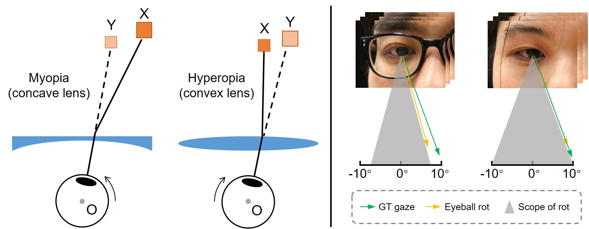

# RefractionGaze
The repository of paper "Towards Eyeglasses Refraction in Appearance-based Gaze Estimation". (ISMAR 2023)

<div align="center"></div>

# Requirements
The code is tested with Python 3.7 and torch 1.8.1.

To install the other packages:
```
pip install -r requirements.txt
```

# Data
This repository contains data of the Relative Coordinate Representation (RCR) and eye region images. Please download the data from [Google Drive](https://drive.google.com/file/d/1qceDNR_b8cL4Vbjq2CgbDoZTHzHhUCWf/view?usp=drive_link) and put them in the ```dataset``` directory.

The data is organized as follows:
```
dataset
|-- 001
    |-- 001_000_01.h5
    |-- 001_000_02.h5
    |-- 001_550_01.h5
|-- 002
    |-- ...
    ...
|-- 006
    |-- ...
```

# Train on non-glass data
```
# take ID-001 for example
python main.py --config configs/001.json
```

# Test on testing data
```
# take ID-001 for example
# dim: 0 for pitch, 1 for yaw
# type: 0 for naked-eye results, 1 for corrected results
python draw_test_results.py --data <path_to_npy> --dim 1 --type 1
```
